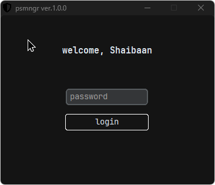

# PSSMngr - Personal Password Manager

A secure, offline password manager that helps you store and manage your passwords locally. Built with Python, PSMngr provides a clean, minimal interface while keeping your sensitive data encrypted and secure on your local machine.



## Features

- 🔒 Local storage - your data never leaves your machine
- 🔐 Strong encryption for stored passwords
- 💻 Clean, minimal interface
- 🔑 Master password protection
- 📝 Add, view, edit, and delete password entries

## Installation

1. Clone the repository
```bash
git clone https://github.com/shybruh/pssmngr.git
cd pssmngr
```

2. Create a virtual environment (recommended)
```bash
python -m venv venv
source venv/bin/activate  # On Windows: venv\Scripts\activate
```

3. Install dependencies
```bash
pip install -r requirements.txt
```

## Requirements

- Python 3.8+
- cryptography
- pyperclip
- rich
- typer

## Usage

1. Start the application:
```bash
python main.py
```

2. On first run, you'll be prompted with a master password
3. Use the following:
   - `add` - Add a new password entry
   - `view` - View stored passwords
   - `edit` - Modify existing entries
   - `delete` - Remove password entries
   - `import csv` - Import from backup csv

## Security Features

- AES-256 encryption for stored passwords
- Zero trust architecture - all data stored locally
  
## Contributing

Contributions are welcome! Please feel free to submit a Pull Request.

## License

This project is licensed under the WTFPL License

## Disclaimer

This is a personal project intended for learning purposes. Please review the code and use at your own discretion.

